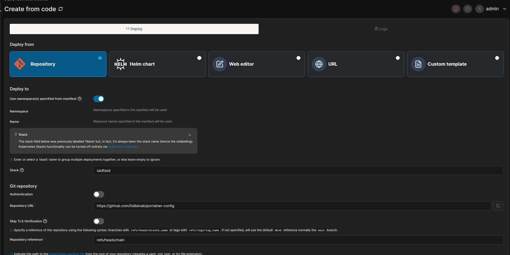
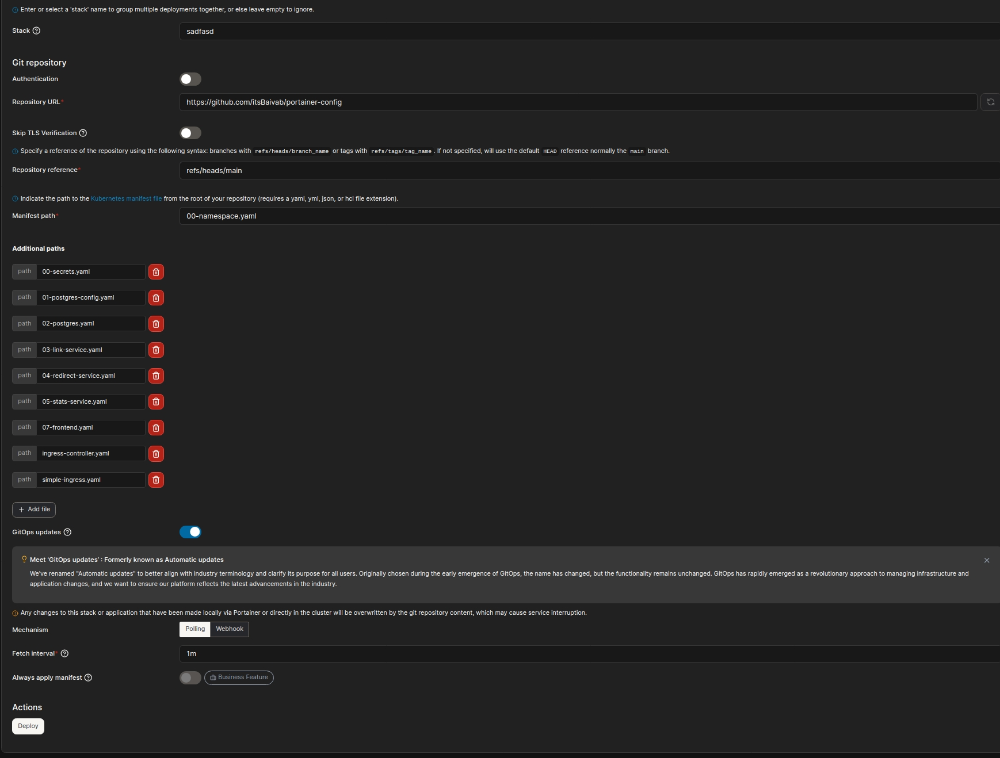

# Complete AKS GitOps Deployment with Portainer

This comprehensive guide covers deploying the URL Shortener microservices application on **Azure Kubernetes Service (AKS)** using **GitOps** principles with **Portainer** for visual management.

## 🚀 **AKS Cluster Setup**

### **1. Prerequisites**

```bash
# Install required tools
az --version          # Azure CLI
kubectl version       # Kubernetes CLI
helm version          # Helm package manager (optional)
```

### **2. Create AKS Cluster**

```bash
# Set variables
export RESOURCE_GROUP="url-shortener-rg"
export CLUSTER_NAME="url-shortener-aks"
export LOCATION="eastus"

# Create resource group
az group create --name $RESOURCE_GROUP --location $LOCATION

# Create AKS cluster with auto-scaling
az aks create \
  --resource-group $RESOURCE_GROUP \
  --name $CLUSTER_NAME \
  --node-count 3 \
  --enable-addons monitoring \
  --enable-cluster-autoscaler \
  --min-count 1 \
  --max-count 10 \
  --node-vm-size Standard_B2s \
  --generate-ssh-keys

# Get AKS credentials
az aks get-credentials --resource-group $RESOURCE_GROUP --name $CLUSTER_NAME

# Verify cluster connection
kubectl cluster-info
kubectl get nodes
```

### **3. Deploy Portainer on AKS**

```bash
# Create Portainer namespace
kubectl create namespace portainer

# Deploy Portainer with LoadBalancer service
kubectl apply -n portainer -f https://downloads.portainer.io/ce-lts/portainer-lb.yaml

# Check Portainer deployment
kubectl get pods -n portainer
kubectl get svc -n portainer

# Get Portainer external IP (wait for LoadBalancer provisioning)
kubectl get svc portainer -n portainer -w
```

### **4. Access Portainer Dashboard**

```bash
# Get external IP
PORTAINER_IP=$(kubectl get svc portainer -n portainer -o jsonpath='{.status.loadBalancer.ingress[0].ip}')
echo "Portainer URL: http://$PORTAINER_IP:9000"

# Open in browser
echo "Initial setup: Create admin user at http://$PORTAINER_IP:9000"
```
Once logged in, enter you license key to get you 3 node cluster free license that you recived in you gmail.

```bash
example key looks like this 
3-4YcvT0KJoyYuq+V24d3ldVvMoEpqoX2ThprHbTdsokfPxeKgxQ/5u9mMrqrbxE76MFjORQ2FK2FT8ggwlXNzeEj+TCJ65WRsdfpadf1Y=

```
Congatulations! You now have Portainer running on AKS.

## 📁 **File Structure Overview**

This directory contains all Kubernetes manifests organized by deployment order:

```
k8s/gitopsportainer/
├── 00-namespace.yaml              # Creates url-shortener namespace
├── 00-secrets.yaml                # Database credentials and app secrets
├── 01-postgres-config.yaml        # PostgreSQL initialization SQL
├── 02-postgres.yaml               # PostgreSQL StatefulSet with persistent storage
├── 03-link-service.yaml           # Link generation microservice
├── 04-redirect-service.yaml       # URL redirection microservice
├── 05-stats-service.yaml          # Analytics and statistics microservice
├── 07-frontend.yaml               # Frontend web application with nginx
├── deploy.sh                      # Automated deployment script
├── ingress-controller.yaml        # NGINX Ingress Controller installation
├── simple-ingress.yaml            # Basic ingress configuration
├── kustomization.yaml             # Kustomize configuration file
└── README-GITOPS.md              # This comprehensive guide
```

## 🚀 **Deployment Instructions**

### **Option 1: Automated Deployment **

```bash
# Navigate to GitOps directory
cd k8s/gitopsportainer/

# Run automated deployment script
./deploy.sh

# Monitor deployment progress
kubectl get pods -n url-shortener -w
```


```bash
# 1. Create namespace and secrets
kubectl apply -f 00-namespace.yaml
kubectl apply -f 00-secrets.yaml

# 2. Deploy PostgreSQL database
kubectl apply -f 01-postgres-config.yaml
kubectl apply -f 02-postgres.yaml

# Wait for PostgreSQL to be ready
kubectl wait --for=condition=ready pod/postgres-0 -n url-shortener --timeout=300s

# 3. Deploy microservices
kubectl apply -f 03-link-service.yaml
kubectl apply -f 04-redirect-service.yaml
kubectl apply -f 05-stats-service.yaml

# 4. Deploy frontend
kubectl apply -f 07-frontend.yaml

# 5. Optional: Deploy ingress
kubectl apply -f ingress-controller.yaml
kubectl apply -f simple-ingress.yaml
```

```bash
# Deploy everything with kustomize
kubectl apply -k .

# Check deployment status
kubectl get all -n url-shortener
```

## 🖼️ Assets for Portainer

Current images included:


*deployment or UI screenshot*




